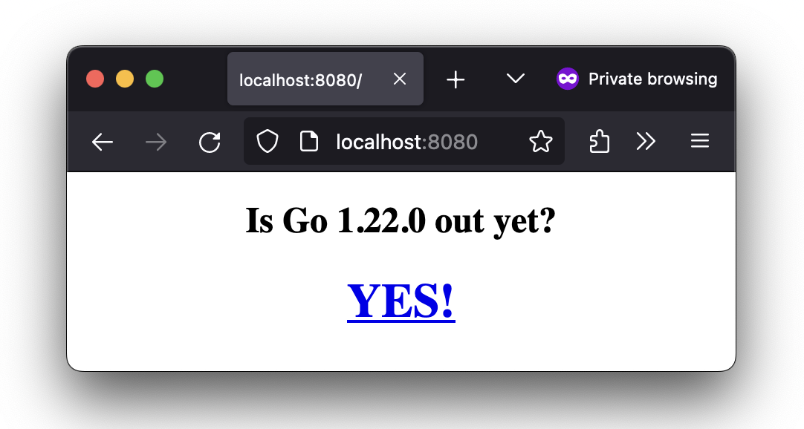

# go-outyet

> Source: https://github.com/golang/example/blob/master/outyet/main.go

A sample Go app which answers to the question: "Is Go 1.4 out yet?"

## How to run it locally

Checkout the repo, switch to the repository root and run the following command to build an image:

```
docker build -t local:outyet .
```

Run docker image:
```
docker run --rm -p 8080:8080 -d --name outyet local:outyet
```

Check container logs if the app is running:
```
docker logs outyet
```

To access the app open your browser and type `localhost:8080` on the URL or run curl command on your terminal:
```
curl localhost:8080
```



Stop container by running:
```
docker stop outyet
```

## Deployment

GitHub workflow builds and pushes an image to GitHub packages after pushing a new repository tag
